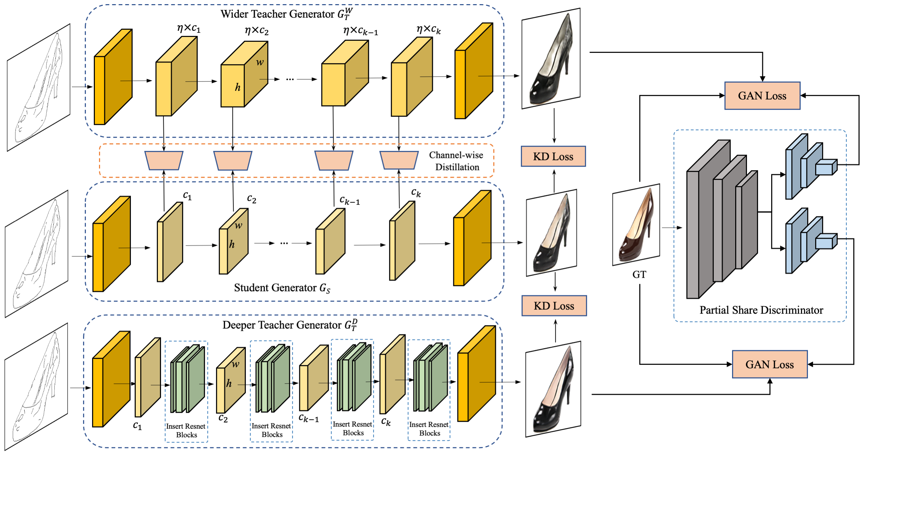
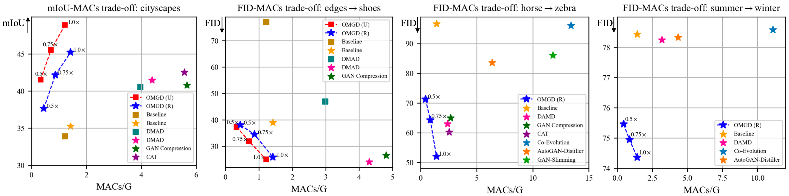

# Online Multi-Granularity Distillation for GAN Compression (ICCV2021)

This repository contains the pytorch codes and trained models described in the ICCV2021 paper "[Online Multi-Granularity Distillation for GAN Compression](https://arxiv.org/pdf/2108.06908.pdf)".  This algorithm is proposed by ByteDance, Intelligent Creation, CV AutoML Team (字节跳动-智能创作-CV AutoML团队). 

Authors: Yuxi Ren*, Jie Wu*, Xuefeng Xiao, Jianchao Yang.

## Overview



## Performance




## Prerequisites

* Linux
* Python 3
* CPU or NVIDIA GPU + CUDA CuDNN

## Getting Started

### Installation

- Clone this repo:

  ```shell
  git clone https://github.com/bytedance/OMGD.git
  cd OMGD
  ```

- Install dependencies.

  ```shell
  conda create -n OMGD python=3.7
  conda activate OMGD
  pip install torch==1.7.0 torchvision==0.8.0 torchaudio==0.7.0 
  pip install -r requirements.txt 
  ```

### Data preparation

- edges2shoes

    - Download the dataset
    ```shell
    bash datasets/download_pix2pix_dataset.sh edges2shoes-r
    ```
  
    - Get the statistical information for the ground-truth images for your dataset to compute FID. 
    ```shell
    bash datasets/download_real_stat.sh edges2shoes-r B
    ```
    
- cityscapes
    
    - Download the dataset
    Download the dataset (*gtFine_trainvaltest.zip* and *leftImg8bit_trainvaltest.zip*) from [here](https://cityscapes-dataset.com), and preprocess it. 
    ```shell
    python datasets/get_trainIds.py database/cityscapes-origin/gtFine/
    python datasets/prepare_cityscapes_dataset.py \
    --gtFine_dir database/cityscapes-origin/gtFine \
    --leftImg8bit_dir database/cityscapes-origin/leftImg8bit \
    --output_dir database/cityscapes \
    --train_table_path datasets/train_table.txt \
    --val_table_path datasets/val_table.txt
    ```
      
    - Get the statistical information for the ground-truth images for your dataset to compute FID. 
    ```shell
    bash datasets/download_real_stat.sh cityscapes A
    ```

- horse2zebra

    - Download the dataset
    ```shell
    bash datasets/download_cyclegan_dataset.sh horse2zebra
    ```

    - Get the statistical information for the ground-truth images for your dataset to compute FID. 
    ```shell
    bash datasets/download_real_stat.sh horse2zebra A
    bash datasets/download_real_stat.sh horse2zebra B
    ```
    
- summer2winter

    - Download the dataset
    ```shell
    bash datasets/download_cyclegan_dataset.sh summer2winter_yosemite
    ```
    - Get the statistical information for the ground-truth images for your dataset to compute FID from [here](https://drive.google.com/drive/folders/1JKJlpUDdD4TdXdwPwfdWUiF4PsXLAbto)

### Pretrained Model

We provide a list of pre-trained models in [link](https://drive.google.com/drive/folders/1lDSguCuRDKl2bKQzAuc8hR-UE7eTqWvW?usp=sharing). DRN model can used to compute mIoU [link](https://drive.google.com/drive/folders/0B_4LoEXGO1TwcmhzLXpWUVFEMXM?resourcekey=0-PMTQHtlWMtSBYozjajFLXA).


### Training

- pretrained vgg16
  we should prepare weights of a vgg16 to calculate the style loss 
  
- train student model using OMGD
  Run the following script to train a unet-style student on cityscapes dataset, 
  all scripts for cyclegan and pix2pix on horse2zebra,summer2winter,edges2shoes and cityscapes can be found in ./scripts

  ```shell
  bash scripts/unet_pix2pix/cityscapes/distill.sh
  ```

### Testing

- test student models, FID or mIoU will be calculated, take unet-style generator on cityscapes dataset as an example

  ```shell
  bash scripts/unet_pix2pix/cityscapes/test.sh
  ```

## Citation

If you use this code for your research, please cite our paper.
  ```shell
@article{ren2021online,
  title={Online Multi-Granularity Distillation for GAN Compression},
  author={Ren, Yuxi and Wu, Jie and Xiao, Xuefeng and Yang, Jianchao},
  journal={arXiv preprint arXiv:2108.06908},
  year={2021}
}
```

## Acknowledgements

Our code is developed based on [GAN Compression](https://github.com/mit-han-lab/gan-compression)
